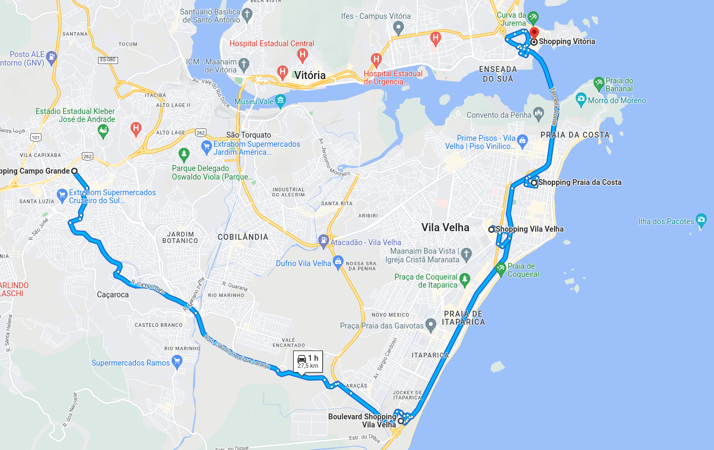
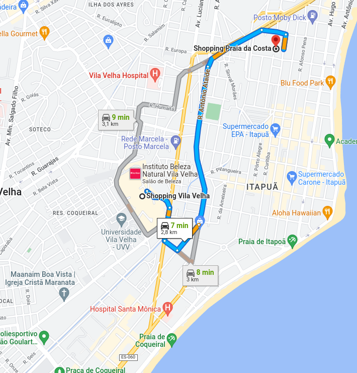
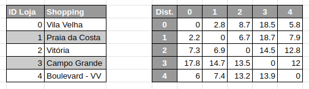
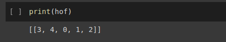

# Calculating Routes with Deap

**Obs:** Este projeto tem fins educacionais.

---

## 1 - Business Problems ( Problemas de Negócio )

### 1.1 - Bella Cucina
A Bella Cucina (empresa fictícia), é uma rede de restaurantes, localizada na Região Metropolitana da Grande Vitória.

### 1.2 - O Problema
Um dos problemas que todos os restaurantes enfrentam é de manter o melhor sabor de suas comidas, e para isto é indispensável que os ingredientes sejam frescos. Os restaurantes sempre precisam de uma alta frequência de entrega dos fornecedores para sempre servir os melhores produtos. Na Bella Cucina o chefe de cozinha recebe todos os ingredientes e redistribui todo dia pela manhã, entre os seus restaurantes. O problema que ele enfrenta é em qual rota ele deve fazer a fim de minimizar o tempo gasto no transporte.

## 2 - Solution Strategy ( Estratégia de Solução )
Os restaurantes estão localizados em alguns Shoppings da Grande Vitória, para calcular a melhor rota possível precisaremos das distancias entre os Shoppings. Usando o Google maps obteremos as distancias entre os restaurantes, e utilizando o Deap(algoritmo evolutivo) calcularemos a menor rota.

### 2.1 - Data Description ( Descrição dos dados )
Os dados coletados pelo Google maps:

Observando as distâncias entre as lojas é possível perceber que sair do Shopping “A” para o Shopping “B” é diferente de sair do “B” para o “A”. Por exemplo:

- Saindo do Shopping Vila Velha para o Praia da Costa = 2.8 km
- Saindo do Shopping Praia da Costa para Vila Velha = 2.2 km

Isso ocorre porque algumas ruas são de via única, fazendo com que sejam tomados caminhos diferentes dependendo de qual local se inicia o trajeto.

### 2.2 - Deap
DEAP (Distributed Evolutionary Algorithms in Python) é uma nova estrutura de computação evolutiva para prototipagem rápida e teste de ideias. Ele é uma ferramenta de busca e otimização para a solução dos mais diferentes tipos de problemas.
- Maximização ou Minimização, de Único Objetivo ou Múltiplas Funções Objetivo

[Documentação do Deap](https://deap.readthedocs.io/en/master/)

Usando o Deap buscamos encontrar o indivíduo com a melhor rota, que nesse caso é a rota com menor valor (Minimização).

Para este projeto foram utilizadas 50 gerações. E o resultado para a melhor rota:

A melhor rota:

Todos os códigos e visualizações deste projeto podem ser seguidos neste [Notebook](https://github.com/jlcunha/calculating_routes_with_deap/blob/main/Deap.ipynb).
## 3 - Conclusions ( Conclusões )
* O Deap é um algoritmo muito interessante, ele resolve diversos tipos de problemas e com muita eficiência. O que mais me chamou atenção é que ele é ótimo para encontrar os melhores hiperparâmetros em modelos de ML.

## 4 - Next Steps to Improve ( Próximos passos )
* Utilizar de técnicas de web scraping para coletar as distâncias, com objetivo de automatizar o processo.

## 5 - Author

Lucas da Cunha
Data Scientist em formação

[Portfolio de Projetos](https://jlcunha.github.io/portfolio_projetos/)

[GitHub Profile](https://github.com/jlcunha/)

[Medium](https://medium.com/@lucasdacunh)
